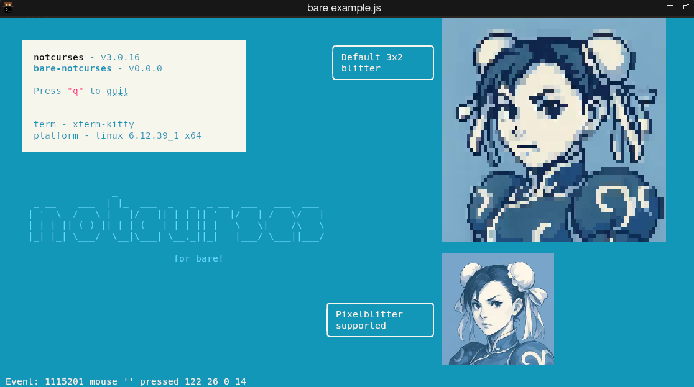

# bare-notcurses

[Bare](https://github.com/holepunchto/bare) and Node bindings for [Notcurses](https://github.com/dankamongmen/notcurses).

This is a prerelease, docs are not yet written.
Refer to ["example.js"](./example.js) and the section 3 [manpages](https://notcurses.com/) for usage.

(open issue when something is missing)

