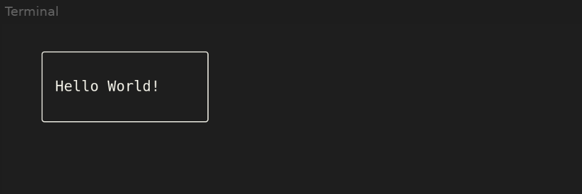

# bare-notcurses

[Notcurses](https://github.com/dankamongmen/notcurses) for [Bare](https://github.com/holepunchto/bare) and Node. <!-- <sup>(yay!)</sup> -->

## Install

```bash
npm i --save bare-notcurses
```

## Usage

```js
import {
  Notcurses,
  Plane
} from 'notcurses-bare'

const nc = new Notcurses({ uncaught: true })

nc.inputStart(event => {
  // restore terminal and exit
  nc.destroy()
})

const plane = new Plane(nc, {
  y: 1,
  x: 4,
  rows: 5,
  cols: 20
})

plane.putstr('Hello World!', 2, 2)
plane.perimeterRounded()

nc.render()
```



## API

### `Notcurses`
[notcurses(3)](https://notcurses.com/notcurses.3.html)

#### `const nc = new Notcurses(opts = {})`

Initialize notcurses.

Options:
```js
{
  // call nc.startInput() with provided handler
  oninput: InputEvent => {}

  // Enable uncaught exception handler which
  // first destroys notcurses then prints the error
  uncaught: false
}
```

#### `nc.stdplane`
[notcurses_stdplane(3)](https://notcurses.com/notcurses_stdplane.3.html)

getter for the standard `Plane`

#### `nc.pixelSupport`

`true` when terminal has supports pixel protocols,
(`NCBLIT_PIXEL` should work).

#### `nc.inputStart(handler, miceEvents = NCMICE_NO_EVENTS)`
Start notcurses' non-blocking input system.

`handler` should be an `(InputEvent) => {}` callback.

Valid flags for `miceEvents`:
```js
import {
  NCMICE_NO_EVENTS, // default
  NCMICE_MOVE_EVENT,
  NCMICE_BUTTON_EVENT,
  NCMICE_DRAG_EVENT,
  NCMICE_ALL_EVENTS,
} from 'bare-notcurses'
```

#### `nc.inputStop()`
Stop the input system


#### `nc.render()`
Render current changes to screen

#### `nc.destroy()`
Destroy notcurses, releases all resources and
restores the terminal.

Call before exit.

### `Plane`

[notcurses_plane(3)](https://notcurses.com/notcurses_plane.3.html)

#### `const plane = new Plane(notcurses, options = {})`

Create a new plane on the `Notcurses` instance

Options:

```js
{
  y: 0,
  x: 0,
  rows: 5,
  cols: 20,
  marginBottom: 0,
  marginRight: 0

  // called when terminal dimensions change
  onresize: () => {}

  // see below
  flags: NCPLANE_OPTION_*,
}
```

Valid `flags`:

```js
import {
  NCPLANE_OPTION_HORALIGNED,
  NCPLANE_OPTION_VERALIGNED,
  NCPLANE_OPTION_MARGINALIZED,
  NCPLANE_OPTION_FIXED,
  NCPLANE_OPTION_AUTOGROW,

  // If set, when cursor movement
  // exceeds `plane.dimY`, then content
  // is pushed upwards discarding the top row.
  // Must be enabled to `putstr()` line-breaks (`'\n'`)
  NCPLANE_OPTION_VSCROLL
} from 'bare-notcurses'
```

#### `plane.y`
getter, plane vertical row offset

#### `plane.x`
getter, plane horizontal column offset

#### `plane.dimY`
getter, plane height in rows

#### `plane.dimX`
getter, plane width in columns

#### `plane.name`
accessor, string (has no specific use)

#### `plane.cursorY`
getter, the plane's cursor position in rows

#### `plane.cursorX`
getter, the plane's cursor position in columns

#### `plane.styles`
accessor, get or set the following flags,
controls text-style:

```js
import {
  NCSTYLE_MASK,
  NCSTYLE_ITALIC,
  NCSTYLE_UNDERLINE,
  NCSTYLE_UNDERCURL,
  NCSTYLE_BOLD,
  NCSTYLE_STRUCK,
  NCSTYLE_NONE
} from 'bare-notcurses'
```

#### `plane.channels`
accessor, get or set current `Channels`,
controls foreground and background.
See `Channels` for extended use.

#### `plane.move(y, x)`
Move plane to specified row, cols position within parent

#### `plane.resize(rows, cols)`
Resize plane to new dimension

#### `plane.erase()`
Clear all content and all cells are reset to basecell.

#### `plane.setBase(egc = ' ', styles = NCSTYLE_NONE, channels = 0n)`
Set the base cell used to render the plane.
`egc` character used draw empty space, defaults to space.
`styles` mask used to alter text style (see `plane.styles`).
`channels` color information in `Channels|BigInt` (see `plane.channels`).

#### `plane.putstr(str, y = -1, x = -1)`

[notcurses_output(3)](https://notcurses.com/notcurses_output.3.html)

Print text to plane at specified `y` and `x` position.
Leaving either offset at `-1` begins printing at plane's current
cursor position.

#### `plane.vline(egc, len, styles = NCSTYLE_NONE, channels = 0n)`
Draw a vertical line using character `egc` on the plane
beginning from current cursor position and downwards `len` amount of rows.
`styles` mask used to alter text style (see `plane.styles`).
`channels` color information in `Channels|BigInt` (see `plane.channels`).

#### `plane.cursorMove(y, x)`
Reposition cursor to `y` rows, `x` columns.

#### `plane.home()`
Reposition cursor to `0, 0`

#### `plane.moveTop()`
Move plane to top of pile, Z-order to front.

#### `plane.moveBottom()`
Move plane to bottom of pile, Z-order to back.

#### `plane.mergeDown(dstPlane)`
Copies contents of current plane to `dstPlane`
where dimensions intersect.

#### `plane.perimeterRounded(styleMask = NCSTYLE_NONE, channels = 0n, ctlword = 0)`
Draw a perimeter around inner edge of the plane using unicode rounded line.

#### `plane.perimeterDouble(styleMask = NCSTYLE_NONE, channels = 0n, ctlword = 0)`
Draw a perimeter around inner edge of the plane using double line.

(only two basic perimeters are currently exported, open
issue if full perimeter drawing support is required)

#### `plane.destroy()`
Destroy the plane and release it's resources.

### `InputEvent`

[notcurses_input(3)](https://notcurses.com/notcurses_input.3.html)

Event received through callback:

```js
nc.inputStart(event => {
  const {
    id,

    // string: 'unknown|pressed|repeated|released'
    type

    // `true` if mouse event
    mouse,

    y,
    x,
    ypx,
    xpx

    // keyboard properties

    // character
    utf8,

    // NCKEY_MOD_* mask
    modifiers

    // individual modifiers
    alt,
    ctrl,
    shift,
    meta,
    super,
    hyper,
    capslock,
    numlock
  } = event
})
```

### `Channels`
[notcurses_channels(3)](https://notcurses.com/notcurses_channels.3.html)

Wrapper around an unsigned 64bit integer holding
foreground and background colors.

`Channel` instance is interchangable with `BigInt`

#### `const channel = new Channel(channels = 0n)`

#### `channel.value`
accessor, get underlying `BigInt`
or set the channel to specified value.

#### `channel.fg`
accessor, get  32bit-packed `number` foreground channel,
or set foreground channel.

#### `channel.bg`
accessor, get  32bit-packed `number` background channel,
or set background channel.

#### `channel.fgRgb`
accessor, set foreground channel to use 24bit color `0xFF8800`

#### `channel.fgIdx`
accessor, set foreground channel to use indexed color (0-16)
(use terminal colorscheme palette)

#### `channel.isFgRgb`
getter, `true` when foreground is using RGB color.

#### `channel.isFgIndexed`
getter, `true` when foreground is using palette.

#### `channel.isFgDefault`
getter, `true` if foreground is set to default.
(usually the semi-transparent color in many terminal emulators)

#### `channel.bgRgb`
accessor, set background channel to use 24bit color `0xFF8800`

#### `channel.bgIdx`
accessor, set background channel to use indexed color (0-16)
(use terminal colorscheme palette)

#### `channel.isBgRgb`
getter, `true` when background is using RGB color.

#### `channel.isFgIndexed`
getter, `true` when background is using palette.

#### `channel.isFgDefault`
getter, `true` if background is set to default.
(usually the semi-transparent color in many terminal emulators)

#### `channel.reverse`
getter, returns `Channels` with foreground and background swapped

#### `channel.push()`
convenience method to save a channel's current value before temporary modification.

#### `channel.pop()`
restore channel to pushed value

#### `Channel.from(<Channel|BigInt|number>, [number])`
Creates a new channel, from value[s].

Valid inputs:
```js
// Clone another channel
Channel.from(otherChannel)

// fgChannel32, bgChannel32
Channel.from(42, 37)

// Wrap a BigInt
Channel.from(0n)

// same as new Channel()
Channel.from()
```

### `Visual`

[notcurses_visual(3)](https://notcurses.com/notcurses_visual.3.html)

A special plane capable of holding pixels and generative content.

#### `const visual = new Visual(notcurses, data, width, height, bytesPerPixel = 4)`
Initialize a visual with RGB(A) pixel `data`.

#### `visual.blit(dstPlane, scaling = NCSCALE_STRETCH, blitter = NCBLIT_DEFAULT, flags)`

Blits a visual to a normal `plane`.

Scaling options:

```js
import {
  NCSCALE_NONE,
  NCSCALE_SCALE,
  NCSCALE_STRETCH,
  NCSCALE_NONE_HIRES,
  NCSCALE_SCALE_HIRES
} = from 'bare-notcurses'
```

Available blitters:

```js
import {
  NCBLIT_DEFAULT,
  NCBLIT_1x1,
  NCBLIT_2x1,
  NCBLIT_2x2,
  NCBLIT_3x2,
  NCBLIT_4x2,
  NCBLIT_BRAILLE,
  NCBLIT_4x1,
  NCBLIT_8x1

  // This blitter can be used on terminals
  // that support pixel protocols,
  // (nc.pixelSupport => true).
  //
  // notcurses will fallback on NCBLIT_DEFAULT
  NCBLIT_PIXEL,
} = from 'bare-notcurses'
```

Flags:

```js
import {
  NCVISUAL_OPTION_NODEGRADE,
  NCVISUAL_OPTION_BLEND,
  NCVISUAL_OPTION_HORALIGNED,
  NCVISUAL_OPTION_VERALIGNED,
  NCVISUAL_OPTION_ADDALPHA,
  NCVISUAL_OPTION_CHILDPLANE,
  NCVISUAL_OPTION_NOINTERPOLATE
} = from 'bare-notcurses'
```

### WIP

This is a prerelease, docs and bindings are incomplete

Refer to ["image.js"](./examples/image.js) and the section 3 of [manpages](https://notcurses.com/) for usage.

_(open issue when something is missing)_


---


